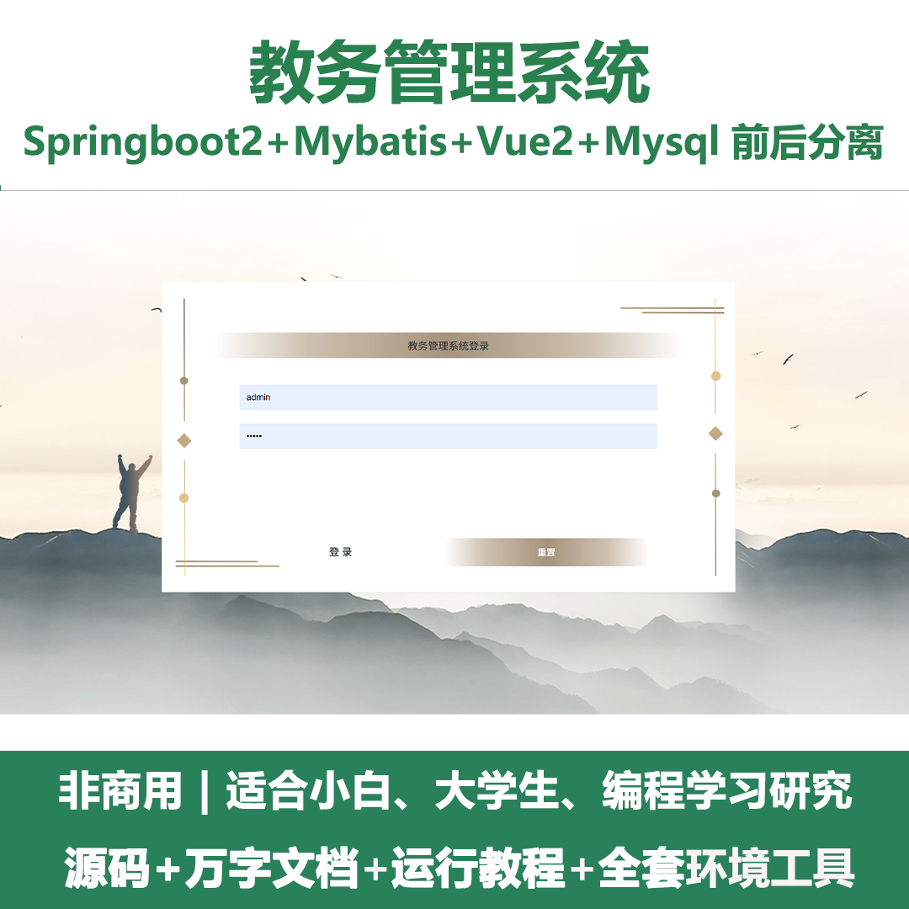
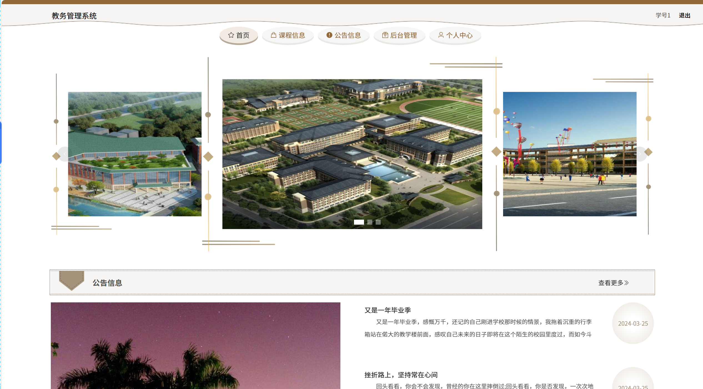
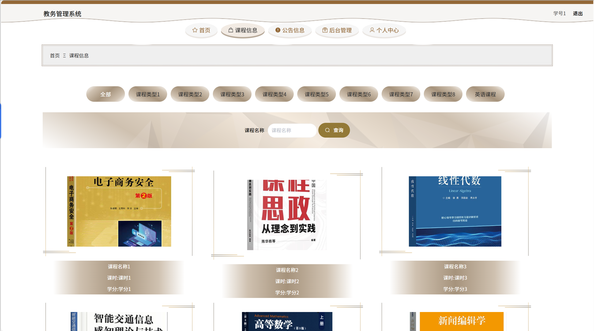
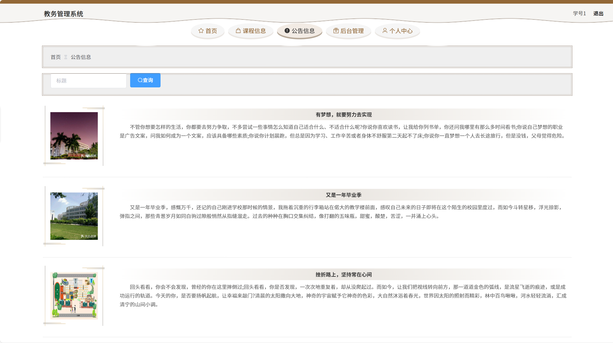
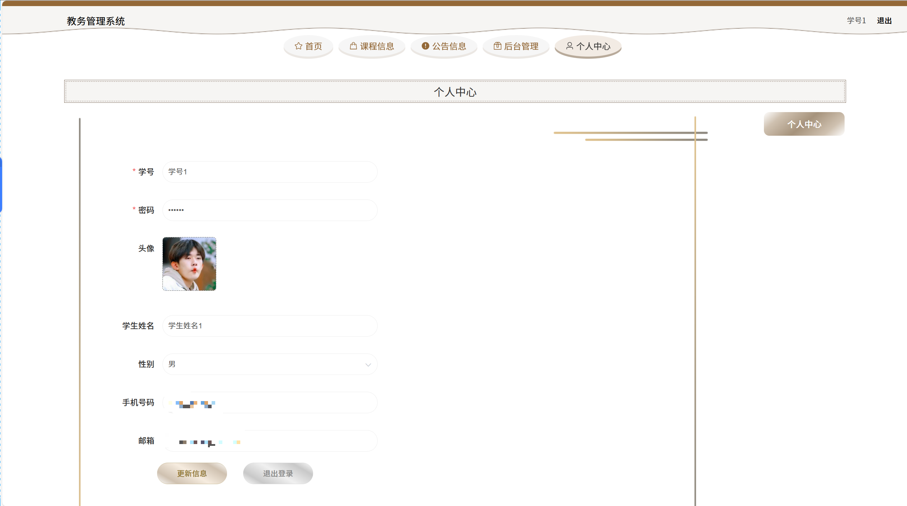
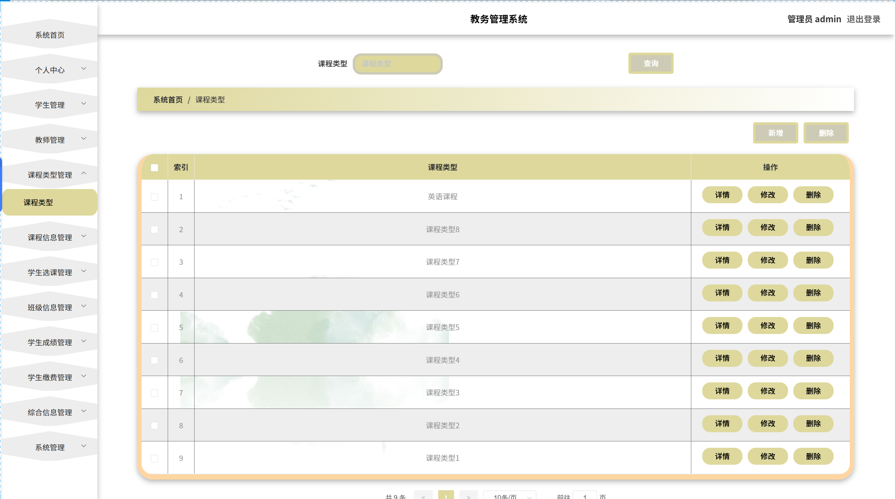
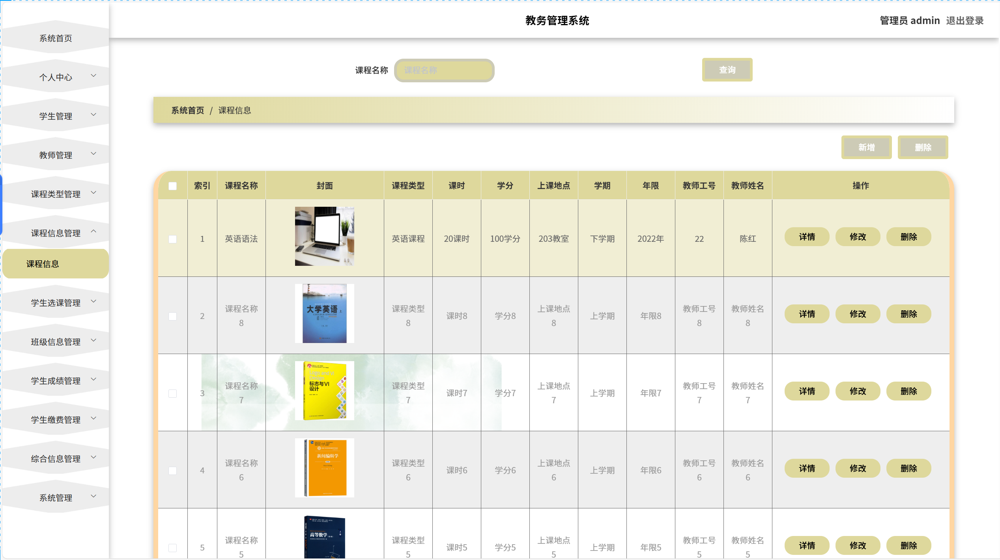
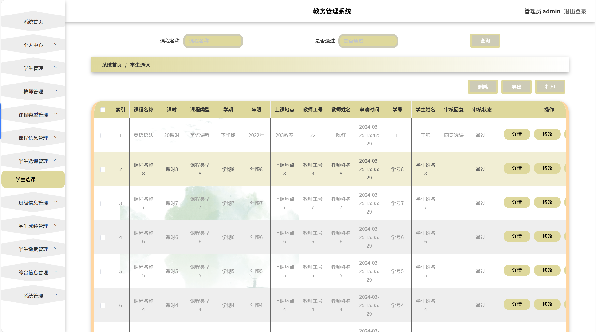
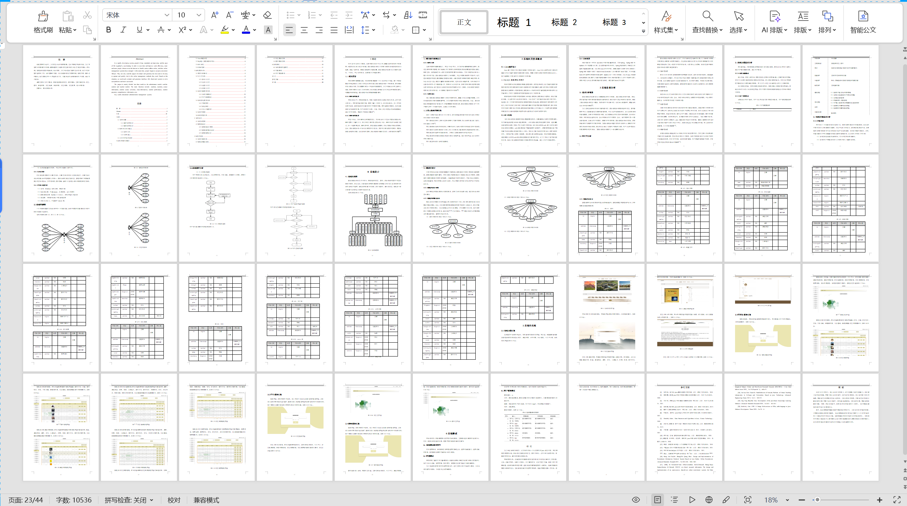

# springbootA409
springbootA409教务管理系统+LW
 
## 查看主页获取源码

### 一、关键词

教学管理系统，课程管理系统，智能教务管理系统

 

### 二、作品包含

源码+数据库+设计文档万字+全套环境和工具资源+部署教程

 

### 三、项目技术

前端技术：Html、Css、Js、Vue2.0、Element-ui 
后端技术：Java、SpringBoot2.0、MyBatis

  

 

### 四、运行环境（以下版本亲测，其他版本未知，请自测）

开发工具：IDEA/eclipse  + VSCODE

数据库：MySQL5.7（最低要5.7版本）

数据库管理工具：Navicat10以上版本

环境配置软件： JDK1.8 + Maven3.6.3

前端Nodejs：14

浏览器：谷歌浏览器

 

### 五、项目介绍

项目编号：springbootA409

人们开始接受方便的生活方式，他们不仅希望页面简单大方，还希望操作方便，可以快速锁定他们需要的线上管理方式。基于这种情况，我们需要这样一个界面简单大方、功能齐全的系统来解决用户问题，满足用户需求。
课题主要分为三大模块：即管理员模块和学生、教师模块，主要功能包括：学生、教师、课程信息、学生选课、班级信息、学生成绩、学生缴费、综合信息等；

### 六、运行截图

